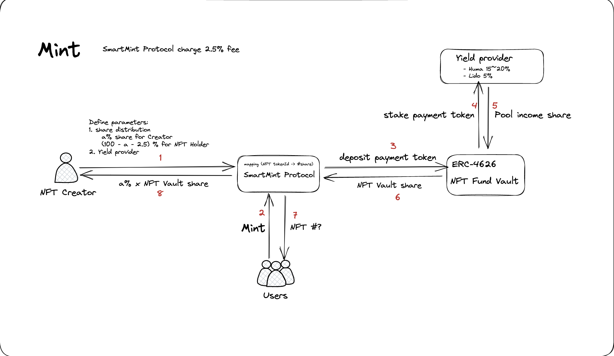
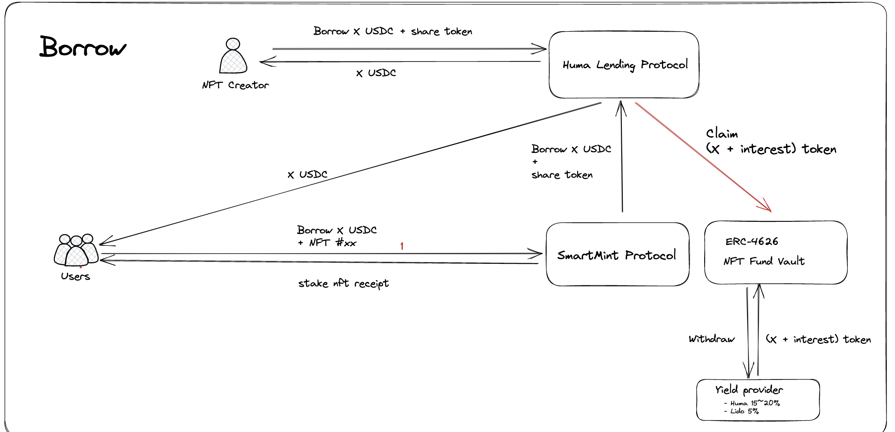
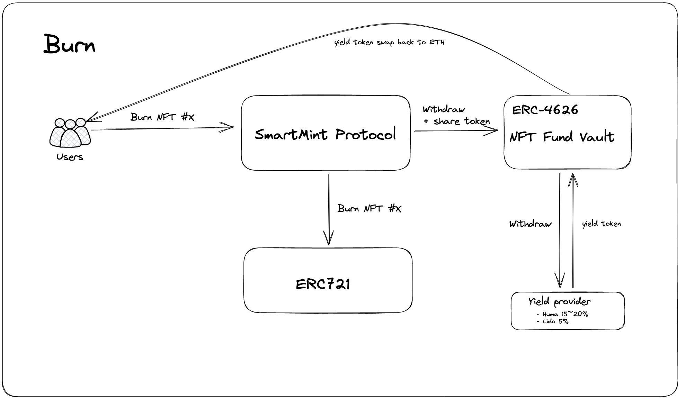

# salusmint
SalusMint is a new project that seeks to bring together the worlds of NFTs and DeFi in a way that benefits both creators and buyers. The project offers a unique approach to NFT launches, with all proceeds from the launch entering a yield-generating pool. This pool provides a sustainable source of income for both creators and holders, and ensures that the incentives of both parties are aligned.

The current NFT market is a zero-sum game, where creators and holders are often at odds with each other. Creators want to make as much money as possible from their NFTs, while buyers are looking to make a quick profit by flipping them. This often leads to rug pulls and other forms of fraud, as creators look to cash out quickly and buyers look for the next hot NFT.

By creating a yield-generating pool that benefits both creators and buyers, SalusMint is hoping to create a more sustainable NFT ecosystem. The pool provides a way for creators to generate income from their NFTs over time, rather than simply cashing out and moving on to the next project. This income can be used as collateral to obtain a loan from Huma Finance, which in turn can provide creators with more resources for their community.

Buyers are also incentivized to hold onto their NFTs, as they can earn income through the yield pool. This creates a virtuous cycle, where both creators and buyers are working together to build a sustainable NFT ecosystem.

The use of DeFi in SalusMint is an important aspect of the project. By leveraging composibility of DeFi, SalusMint is able to create a transparent and trustless system that benefits all participants. The yield-generating pool is powered by smart contracts, which ensure that all proceeds are distributed fairly and transparently.

SalusMint is not the first project to combine NFTs and DeFi, but it is one of the most promising. The team behind the project has a deep understanding of both NFTs and DeFi, and is committed to creating a sustainable ecosystem for both creators and buyers.

Overall, SalusMint represents an exciting new direction for the world of NFTs. By creating a more sustainable ecosystem that benefits both creators and buyers, the project has the potential to revolutionize the way that NFTs are created, bought, and sold. If successful, it could pave the way for a new generation of NFT projects that are built on the principles of transparency, fairness, and sustainability.

## Protocal flow charts

## Deploy Salusmint Core Contracts in local host

1. Start the goerli fork network: `yarn fork https://eth-goerli.g.alchemy.com/v2/<your id>`
2. Run `python3 main.py`
3. Run `npx hardhat run ./scripts/1-deploySmartMintFactory.ts --network localhost`
4. Get USDC address and SalusMint Factory address
5. copy `huma-contracts-fork/deployment/localhost-deployed-contracts.json` to `pool.ts` DEPLOYED_CONTRACTS

## Deploy Salusmint Core Contracts in Polygam Mumai TestNet

## Setup SSV Pool for staking

### Setup the Brownie Envionrment

1. Go to ssv-fork/ssv-contract-fork folder
2. Setup RPC `export WEB3_ALCHEMY_PROJECT_ID=<your id>`
3. Setup deployer private key `brownie accounts new deployer`
4. Install latest openzeppelin contracts `brownie pm install OpenZeppelin/openzeppelin-contracts-upgradeable@4.8.0`

### Deploy the SSV staking pool address

1.  Run `brownie console`
2.  Run `run('deploy')`
3.  You can find it in contrat_addresses.json, it is also printed on the console.

### Run the SSV Staking

1.  Update the Staking pool Contract under sample_config/stake-config.json.
2.  Under ssv-fork folder run `python main.py stake -c sample_config/stake-config.json`.
